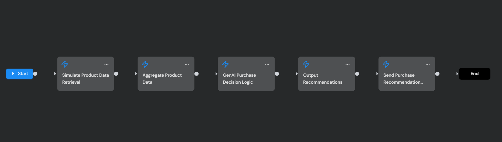
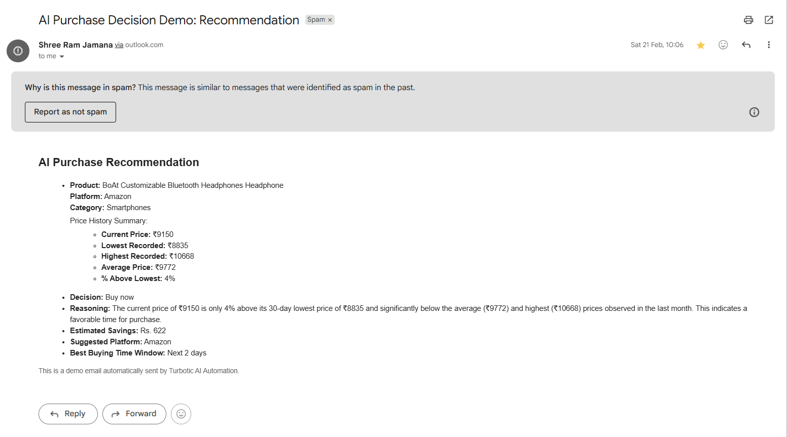

# AI Purchase Intelligence & Price Decision Automation

An AI-powered automation workflow that helps users decide **when and where to buy a product** by analyzing price trends and generating intelligent purchase recommendations.

This project was built as part of the **TurboHaQ’26 GenAI Automation Hackathon** organized by **Turbotic and QiBR Technologies**.

The automation transforms a simple product link into a purchase decision engine using structured data processing, simulated price intelligence, and AI reasoning.

---

## Problem

When buying products online, users often:

- Compare prices across multiple e-commerce platforms
- Check reviews and ratings
- Wait for discounts or sale events
- Track price changes manually

This process is time-consuming and often leads to **impulsive purchases or missed deals**.

---

## Solution

This automation converts a product link into an **AI-powered purchase intelligence workflow** that analyzes price history and recommends the best buying decision.

The system simulates product data, generates price intelligence metrics, and uses AI reasoning to determine whether the user should **buy now or wait for a better deal**.

The final recommendation is automatically delivered via email.

---

## Workflow Architecture

The automation workflow processes a product link through multiple stages including product data simulation, price intelligence analysis, AI decision generation, and automated email delivery.



## Features

- Product link input processing
- Simulated **30-day price history**
- Price intelligence calculations
- AI-powered purchase decision logic
- Estimated savings calculation
- Platform recommendation
- Automated email delivery

---

## Price Intelligence Analysis

The automation simulates a 30-day price history dataset and calculates:

- Current price
- Lowest recorded price
- Highest recorded price
- Average price
- Percentage difference from historical low

These metrics are used to determine whether the product should be purchased immediately or monitored for price drops.

---

## AI Decision Engine

The purchase recommendation is generated using the **Google Gemini API**.

Gemini analyzes the price intelligence summary and provides:

- Buy / Wait recommendation
- Reasoning behind the decision
- Estimated savings
- Suggested buying platform
- Best buying window

---

## Email Automation

After the AI generates the recommendation, the system automatically sends the results to the user via email.

Email delivery is implemented using **Outlook integration within the Turbotic automation platform**.

---

## Project Structure

```
ai-purchase-intelligence-automation/
│
├── README.md
│
├── architecture
│ └── workflow.png
│
├── output
│ └── email-output.png
│
├── src
│ ├── simulateProductData.js
│ ├── aggregateProductData.js
│ ├── genAIPurchaseDecision.js
│ ├── outputRecommendations.js
│ └── sendEmailRecommendation.js
│
└── demo
└── demo-link.md
```


---

## Technologies Used

- Turbotic Automation Platform
- Google Gemini API
- Node.js automation scripts
- Outlook email integration
- Workflow-based automation architecture

---

## Demo Output

Example email output generated by the automation:



---

## Demo

A full demonstration of the automation workflow can be viewed here:

See the demo link in:
```
demo/demo-link.md
```


---

## Note

Price history and product data used in this project are **simulated for prototype demonstration purposes**.

The architecture is designed to integrate with real-time e-commerce APIs and price tracking systems in production environments.

---

## Future Improvements

Potential improvements for a production version:

- Real-time e-commerce API integration
- Historical price database
- Sale event prediction
- Multi-platform price comparison
- Browser extension for automatic product detection

---

## Author

Shree Ram Jamana
